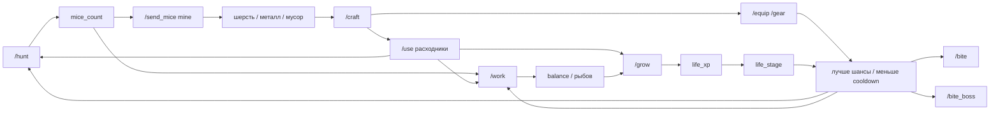
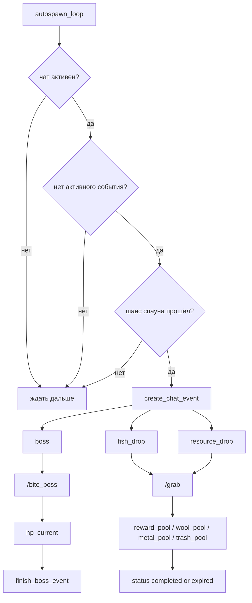

# Шерстяной Синдикат: Диаграмма Проекта

Эта диаграмма показывает, как проект собран на уровне архитектуры: от входящих Telegram-команд до хендлеров, сервисов и БД.

## Архитектура

```mermaid
flowchart TD
    TG["Telegram Chat / Users"] --> BOT["main.py<br/>Bot + Dispatcher + Polling"]
    BOT --> MW["services/activity.py<br/>ChatActivityMiddleware"]

    MW --> HC["handlers/common.py<br/>/start /meow /hunt /stats /reset_me"]
    MW --> HP["handlers/profile.py<br/>/profile"]
    MW --> HI["handlers/inventory.py<br/>/inv"]
    MW --> HCRAFT["handlers/crafting.py<br/>/craft /equip /gear /use"]
    MW --> HM["handlers/mice.py<br/>/work /send_mice mine"]
    MW --> HCOMBAT["handlers/combat.py<br/>/bite /top"]
    MW --> HE["handlers/events.py<br/>/bite_boss /grab /event<br/>/spawn_event /events /end_event /events_auto"]
    MW --> HPROG["handlers/progression.py<br/>/grow /upgrade"]
    MW --> HA["handlers/admin.py<br/>/admin /cooldowns_on/off<br/>/add_fish /reset_fish"]

    HC --> GU["services/game_utils.py<br/>life helpers / cat name<br/>user guards / cooldown guards"]
    HP --> GU
    HM --> GU
    HCOMBAT --> GU
    HE --> GU
    HPROG --> GU
    HCRAFT --> GU
    HC --> UI["services/ui.py<br/>reply keyboard / inline keyboards"]
    HI --> UI
    HCRAFT --> UI
    HC --> ALIAS["services/text_aliases.py<br/>human text aliases"]
    HP --> ALIAS
    HI --> ALIAS
    HCRAFT --> ALIAS
    HM --> ALIAS
    HCOMBAT --> ALIAS
    HE --> ALIAS
    HPROG --> ALIAS

    HPROG --> SP["services/progression.py<br/>XP thresholds / cost / grow chance"]
    HE --> SE["services/events.py<br/>event config / autospawn / boss rewards"]
    HCRAFT --> SC["services/crafting.py<br/>recipes / forge outcomes<br/>gear slots / weapons / consumables"]

    HC --> TXT["data/texts.py<br/>reply pools"]
    HM --> TXT
    HCOMBAT --> TXT
    HE --> TXT
    HPROG --> TXT

    HC --> CONST["data/constants.py<br/>life titles / class labels"]
    HP --> CONST
    HPROG --> CONST

    BOT --> RS["data/runtime_state.py<br/>cooldowns_enabled / auto_events_enabled"]
    HC --> RS
    HM --> RS
    HCOMBAT --> RS
    HE --> RS
    HPROG --> RS
    HA --> RS

    BOT --> LOOP["services/events.py::autospawn_loop"]
    LOOP --> SE

    HC --> DB["database/db_manager.py"]
    HP --> DB
    HI --> DB
    HCRAFT --> DB
    HM --> DB
    HCOMBAT --> DB
    HE --> DB
    HPROG --> DB
    HA --> DB
    GU --> DB
    SE --> DB

    DB --> USERS["users<br/>profile / life_stage / life_xp / balance / mice / authority / last_seen"]
    DB --> INV["inventory<br/>resources / consumables / equipment / buffs"]
    DB --> CD["cooldowns<br/>per-user command cooldowns"]
    DB --> CHAT["chat_activity<br/>chat activity + autospawn gate"]
    DB --> EVENTS["chat_events<br/>boss variants / fish_drop / resource_drop"]
    DB --> PARTS["event_participants<br/>damage / grabs"]
```

## Игровые Потоки

## События

## Где Это Смотреть В Коде

| Что | Файл |
|---|---|
| Запуск бота | `main.py` |
| Работа с БД | `database/db_manager.py` |
| Тексты и реплики | `data/texts.py` |
| Статусы жизней и классы | `data/constants.py` |
| Runtime-флаги | `data/runtime_state.py` |
| Утилиты игрока, user/callback guards и cooldown guards | `services/game_utils.py` |
| Клавиатуры Telegram | `services/ui.py` |
| Текстовые алиасы | `services/text_aliases.py` |
| Рецепты, исходы ковки и бонусы кузницы | `services/crafting.py` |
| Логика роста | `services/progression.py` |
| Логика событий | `services/events.py` |
| Учёт активности чата | `services/activity.py` |
| Базовые команды | `handlers/common.py` |
| Профиль | `handlers/profile.py` |
| Инвентарь | `handlers/inventory.py` |
| Кузница и экипировка | `handlers/crafting.py` |
| Работа и подвал | `handlers/mice.py` |
| PvP | `handlers/combat.py` |
| События | `handlers/events.py` |
| Рост | `handlers/progression.py` |
| Админка | `handlers/admin.py` |
