# Шерстяной Синдикат: Mind Map

Эта карта нужна как быстрый навигатор по игре и коду. Если потерялся, начинай с раздела `Команды`, потом смотри `Игровой цикл` и `Файлы`.

Архитектурная схема проекта лежит отдельно: [project_diagram.md](project_diagram.md)

## Mind Map

```mermaid
mindmap
  root((Шерстяной Синдикат: 9 Жизней))
    Игрок
      Профиль
        /start
        /profile
        /stats
        /inv
        cat_name
        cat_class
        life_stage
        life_xp
        balance
        mice_count
        "новый игрок стартует с 3 мышами"
        authority
      Классы
        none["Без класса"]
        warrior["Кот-Обжорыч / Танк"]
          "стабильнее рост"
          "меньше крит провалов"
          "лучше держит PvP"
          "лучше подвал"
        thief["Кот-Гопник / Вор"]
          "лучше /meow"
          "может красть рыбов в /bite"
          "выше риск на работе"
        support["Кошечка-Ботаник / Саппорт"]
          "дешевле /grow"
          "бонусы к ресурсам"
          "стабильная работа"
        assassin["Кот-Ниндзя / Ассасин"]
          "выше крит"
          "лучше охота"
          "сильнее /bite и /bite_boss"
    Прогрессия
      Девять_Жизней
        "1 Шерстяная личинка"
        "2 Картонный рыцарь"
        "3 Помощник Мяулера"
        "4 Тыгыдык-стажер"
        "5 Бригадир хвостов"
        "6 Диванный эксперт"
        "7 Смотрящий за миской"
        "8 Пушистый авторитет"
        "9 Дон Мяулеоне"
      /grow
        "тратит рыбов"
        "даёт life_xp"
        "успех"
        "крит успех"
        "провал с малым XP"
        "крит провал без XP"
        "/upgrade алиас"
      Будущее
        "Вознесение"
        "Золотые усы"
        "постоянные бонусы"
    Ресурсы
      Рыбов
        "основная валюта"
        /meow
        /work
        /grab_fish["/grab во время рыбного контейнера"]
        /add_fish
        /reset_fish
      Мыши
        "ресурс и рабочая сила"
        /hunt
        /work["/work, работа N: мыши уходят на смену"]
        /send_mice_mine["/send_mice mine, подвал N: мыши уходят в добычу"]
        "крит успех подвала может привести новых мышей"
        "щит в будущих подземельях"
      Материалы
        wool["шерсть"]
        metal["металл"]
        trash["мусор"]
        /send_mice_mine
        /grab_resources["/grab во время ресурсного контейнера"]
        /craft
      Кузница
        /craft
        /equip
        /gear
        /use
        "валерьянка"
        "кошачья мята"
        "мышиный энергетик"
        "лапомазь"
        "шлем"
        "нагрудник"
        "нарукавники"
        "ботинки"
    Core_Loop
      "1 /hunt ловит мышей"
      "2 /work отправляет мышей за рыбами на отложенную смену"
      "3 /send_mice mine добывает материалы после отложенной добычи"
      "4 /grow повышает жизнь"
      "5 /bite даёт PvP и авторитет"
      "6 события дают общий хаос и бонусы"
    UX
      "основная клавиатура после /start"
      "кнопки: Мяу, Охота, Инвентарь, Кузница, Экипировка, Досье"
      "обычные фразы: мой котёнок, досье, инвентарь, кузница, работа 5, подвал 5"
      "помощь показывает краткое описание игры и команды"
      "сброс / сбросить профиль / удалить профиль / начать заново удаляют профиль"
      "завершить работу и завершить подвал проверяют разные отложенные задачи"
      "в группах фразы требуют BotFather /setprivacy Disable"
      "inline-кнопки категорий кузницы"
      "inline-кнопки собрать/надеть/использовать"
    PvE_PvP
      PvP
        /bite
          "reply на игрока"
          "проверка активности цели 2 часа"
          "вор может украсть рыбов"
          "авторитет + / -"
        /top
          "топ авторитета"
      PvE_События
        /bite_boss
          "бьёт Мега-пса"
          "общий HP"
          "фикс награда всем участникам"
        /grab
          "забирает контейнер"
          "показывает остаток рыб/ресурсов"
    События
      Автоспаун
        "фон в main.py"
        "учёт активности чата"
        "кулдаун чата"
        "не спавнит поверх активного события"
      Типы
        boss["Боссы: Мега-пёс / робот-пылесос / Тапок-Титан"]
        fish_drop["Рыбный контейнер"]
        resource_drop["Ресурсный контейнер"]
      Админ_ивенты
        /spawn_event
        /events
        /event
        /end_event
        /events_auto
    Админка
      /admin
      /cooldowns_on
      /cooldowns_off
      /add_fish
      /reset_fish
      /reset_me
    Тексты
      data_texts["data/texts.py"]
        "реплики /meow"
        "реплики /hunt"
        "реплики /work"
        "реплики /bite"
        "реплики /grow"
        "реплики событий"
      data_constants["data/constants.py"]
        "статусы жизней"
        "названия классов"
    Код
      main_py["main.py"]
        "подключает роутеры"
        "стартует polling"
        "стартует autospawn_loop"
      database["database/db_manager.py"]
        "PostgreSQL"
        "миграции при старте"
        "users"
        "inventory"
        "cooldowns"
        "chat_events"
        "event_participants"
        "chat_activity"
      handlers
        common["handlers/common.py: /start /meow /hunt /stats /reset_me"]
        progression["handlers/progression.py: /grow /upgrade"]
        profile["handlers/profile.py: /profile"]
        inventory["handlers/inventory.py: /inv"]
        mice["handlers/mice.py: /work /send_mice"]
        crafting["handlers/crafting.py: /craft /equip /gear /use"]
        combat["handlers/combat.py: /bite /top"]
        events["handlers/events.py: /bite_boss /grab /spawn_event /events /event /end_event /events_auto"]
        admin["handlers/admin.py: /admin /cooldowns_on /cooldowns_off /add_fish /reset_fish"]
      services
        game_utils["services/game_utils.py: имена, user guards, cooldown guards"]
        crafting_service["services/crafting.py: рецепты, экипировка, расходники, бонусы"]
        progression_service["services/progression.py: XP, цена, шанс, рост"]
        events_service["services/events.py: конфиг событий, автоспаун, награды"]
        activity["services/activity.py: активность чата"]
```



## Команды

| Команда | Для кого | Что делает | Где код |
|---|---:|---|---|
| `/start` | игрок | регистрирует профиль | `handlers/common.py` |
| `/help` | игрок | показывает краткое описание игры и основные команды | `handlers/common.py` |
| `/profile` | игрок | показывает имя, статус, класс, баланс и XP жизни | `handlers/profile.py` |
| `/stats` | игрок | показывает досье, шансы и прогресс | `handlers/common.py` |
| `/inv` | игрок | показывает рыбов, мышей и материалы | `handlers/inventory.py` |
| `/meow` | игрок | добывает рыбов напрямую | `handlers/common.py` |
| `/hunt` | игрок | ловит мышей | `handlers/common.py` |
| `/work` | игрок | отправляет мышей на классовую работу за рыбами; результат приходит позже | `handlers/mice.py` |
| `/send_mice mine` | игрок | отправляет мышей за материалами; результат приходит позже, крит успех может привести новых мышей | `handlers/mice.py` |
| `/grow` | игрок | тратит рыбов и качает `life_xp` | `handlers/progression.py` |
| `/upgrade` | игрок | алиас `/grow` | `handlers/progression.py` |
| `/craft` | игрок | показывает рецепты или создаёт расходник/экипировку | `handlers/crafting.py` |
| `/equip` | игрок | надевает экипировку в слот | `handlers/crafting.py` |
| `/gear` | игрок | показывает надетую экипировку | `handlers/crafting.py` |
| `/use` | игрок | использует расходник и даёт бафф на следующую команду | `handlers/crafting.py` |
| `/bite` | игрок | PvP-укус reply на игрока | `handlers/combat.py` |
| `/top` | игрок | топ авторитета | `handlers/combat.py` |
| `/bite_boss` | игрок | атакует активного босса | `handlers/events.py` |
| `/grab` | игрок | забирает рыбов/ресурсы из контейнера | `handlers/events.py` |
| `/event` | игрок/админ | показывает активное событие в текущем чате | `handlers/events.py` |
| `/admin` | админ | список админ-команд | `handlers/admin.py` |
| `/cooldowns_on` | админ | включает кулдауны | `handlers/admin.py` |
| `/cooldowns_off` | админ | выключает кулдауны | `handlers/admin.py` |
| `/add_fish` | админ | выдаёт рыбов | `handlers/admin.py` |
| `/reset_fish` | админ | обнуляет рыбов | `handlers/admin.py` |
| `/spawn_event boss` | админ | запускает случайного босса | `handlers/events.py` |
| `/spawn_event fish` | админ | запускает рыбный контейнер | `handlers/events.py` |
| `/spawn_event resources` | админ | запускает ресурсный контейнер | `handlers/events.py` |
| `/events` | админ | список активных событий | `handlers/events.py` |
| `/end_event` | админ | закрывает событие в текущем чате | `handlers/events.py` |
| `/events_auto on/off` | админ | включает/выключает глобальный автоспаун | `handlers/events.py` |
| `/reset_me` | игрок | удаляет свой профиль | `handlers/common.py` |

## Что За Что Отвечает

| Файл | Ответственность |
|---|---|
| `main.py` | запуск бота, подключение роутеров, фоновый автоспаун |
| `database/db_manager.py` | вся работа с PostgreSQL и авто-миграции |
| `data/constants.py` | статусы жизней и классы |
| `data/texts.py` | все большие пулы реплик |
| `data/runtime_state.py` | runtime-флаги: кулдауны, автоспаун |
| `services/game_utils.py` | общие утилиты игрока, имени, активности, user/callback guards и cooldown-текста |
| `services/ui.py` | основные reply-кнопки и inline-кнопки экранов |
| `services/text_aliases.py` | обычные текстовые фразы, которые открывают игровые действия |
| `services/crafting.py` | рецепты кузницы, слоты экипировки, расходники и бонусы |
| `services/progression.py` | математика `/grow`: XP, цена, шансы, переход жизни |
| `services/events.py` | математика событий, автоспаун, формат событий |
| `services/activity.py` | middleware активности чата |
| `handlers/common.py` | базовые команды, `/meow`, `/hunt`, `/stats` |
| `handlers/progression.py` | `/grow` и `/upgrade` |
| `handlers/crafting.py` | `/craft`, `/equip`, `/gear`, `/use` |
| `handlers/mice.py` | `/work`, `/send_mice mine` |
| `handlers/combat.py` | `/bite`, `/top` |
| `handlers/events.py` | события и админ-управление событиями |
| `handlers/inventory.py` | `/inv` |
| `handlers/profile.py` | `/profile` |
| `handlers/admin.py` | админ-панель, кулдауны, выдача рыбов |

## Текущий Игровой Смысл

Главная петля сейчас такая:

1. Игрок ловит мышей через `/hunt`.
2. Мыши уходят на `/work`, сразу списываются из дома и позже приносят рыбов.
3. Мыши уходят на `/send_mice mine`, сразу списываются из дома и позже приносят материалы; при критическом успехе могут привести новых мышей.
4. Материалы тратятся в `/craft` на расходники и экипировку.
5. Рыбы тратятся на `/grow`.
6. `/grow` повышает `life_xp`, а потом `life_stage`.
7. `/bite` даёт PvP, авторитет и социальный хаос.
8. События дают общие цели: босс, рыбный контейнер, ресурсный контейнер.

## Следующие Большие Пустые Места

| Фича | Зачем нужна |
|---|---|
| Оружие по классам | индивидуальные эффекты оружия для воина, вора, саппорта и ассасина |
| Подземелья | PvE-применение мышей, HP, шмота и классов |
| Банды / кланы | социальная мета после появления стабильного прогресса |
| Вознесение | endgame для 9-й жизни и редкая валюта `Золотые усы` |
| Магазин расходников | рыбов sink, баффы, хил, антицарапки |

Практичный следующий шаг после текущей шлифовки: начать с `Магазина расходников`, потому что он небольшой по объёму, использует уже готовые `inventory`/`buffs` и добавляет новый способ тратить рыбов.

## Команды По Ролям

### Игрок: Профиль И Навигация

| Команда | Когда использовать |
|---|---|
| `/start` | первый вход или повторное приветствие |
| `/help` / `помощь` | кратко понять цель игры и основные действия |
| `/profile` | посмотреть имя, класс, статус и прогресс жизни |
| `/stats` | посмотреть шансы, баланс, мышей и стоимость роста |
| `/inv` | посмотреть рыбов, мышей и материалы |
| `/reset_me` | полностью удалить свой профиль |

### Игрок: Фарм И Прогресс

| Команда | Что даёт | Тратит |
|---|---|---|
| `/meow` | рыбов | cooldown |
| `/hunt` | мышей | cooldown |
| `/work [N]` / `работа N` | рыбов через мышиную работу после задержки | мышей сразу, cooldown |
| `/send_mice mine [N]` / `подвал N` | шерсть, металл, мусор после задержки; при крите бонусные мыши | мышей сразу, cooldown |
| `/craft [recipe_id]` | расходники и экипировка | материалы |
| `/use [название]` | бафф на следующую команду | расходник |
| `/equip [название]` | бонус экипировки | предмет экипировки |
| `/grow` | XP жизни и шанс новой жизни | рыбов, cooldown |
| `/upgrade` | то же, что `/grow` | рыбов, cooldown |

### Игрок: PvP И События

| Команда | Что делает |
|---|---|
| `/bite` | укусить игрока reply-сообщением |
| `/top` | посмотреть топ авторитета |
| `/bite_boss` | ударить активного босса |
| `/grab` | забрать часть активного контейнера |
| `/event` | посмотреть активное событие в текущем чате |

### Админ

| Команда | Что делает |
|---|---|
| `/admin` | показывает админ-панель |
| `/cooldowns_on` | включает cooldown-ы |
| `/cooldowns_off` | выключает cooldown-ы для тестов |
| `/add_fish 100` | добавить рыбов себе |
| `/add_fish USER_ID 100` | добавить рыбов игроку |
| `/reset_fish` | обнулить рыбов себе |
| `/reset_fish USER_ID` | обнулить рыбов игроку |
| `/spawn_event boss` | вручную запустить случайного босса |
| `/spawn_event fish` | вручную запустить рыбный контейнер |
| `/spawn_event resources` | вручную запустить ресурсный контейнер |
| `/events` | список активных событий во всех чатах |
| `/end_event` | закрыть событие в текущем чате |
| `/events_auto on/off` | включить или выключить глобальный автоспаун |

## База Данных

`database/db_manager.py` сам добавляет недостающие таблицы и колонки при старте бота через `ensure_schema`.

| Таблица | Что хранит | Важные поля |
|---|---|---|
| `users` | профиль игрока | `user_id`, `cat_name`, `cat_class`, `life_stage`, `life_xp`, `balance`, `mice_count`, `authority`, `last_seen` |
| `inventory` | ресурсы, расходники, баффы и экипировка | `user_id`, `item_name`, `item_type`, `bonus_value`, `is_equipped` |
| `cooldowns` | личные cooldown-ы команд | `user_id`, `command`, `available_at` |
| `chat_activity` | активность чатов для автоспауна | `chat_id`, `last_seen`, `next_event_after`, `auto_events_enabled` |
| `chat_events` | активные и завершённые события | `chat_id`, `event_type`, `status`, `hp_current`, `reward_pool`, `wool_pool`, `metal_pool`, `trash_pool`, `ends_at` |
| `event_participants` | участники событий | `event_id`, `user_id`, `damage`, `grabs`, `last_action_at` |

### DB Методы, Которые Чаще Всего Нужны

| Метод | Для чего |
|---|---|
| `get_user` | получить профиль |
| `register_user` | создать профиль |
| `touch_user` | обновить активность игрока |
| `touch_chat` | обновить активность чата |
| `update_balance` | добавить/снять рыбов |
| `update_mice_count` | добавить/снять мышей |
| `get_resources` | прочитать материалы |
| `_add_inventory_amount` / `_add_resource_amounts` | внутренние helper-ы DBManager для пополнения инвентаря и ресурсов |
| `craft_inventory_item` | списать материалы и создать предмет |
| `equip_item` | надеть предмет в слот экипировки |
| `consume_inventory_item` | потратить расходник |
| `consume_buff` | потратить активный одноразовый бафф |
| `get_cooldown` / `set_cooldown` | cooldown-ы команд |
| `apply_grow_result` | применить результат `/grow` |
| `start_mouse_job` | списать мышей и поставить отложенную работу/подвал одной транзакцией |
| `complete_mouse_work_job` | завершить отложенную `/work` |
| `complete_mice_mining_job` | завершить отложенную `/send_mice mine` |
| `apply_bite_result` | применить PvP `/bite` |
| `create_chat_event` | создать событие |
| `add_boss_damage` | нанести урон боссу |
| `finish_boss_event` | закрыть босса и выдать награды |
| `grab_event_loot` | забрать часть контейнера |

## Балансные Ручки

Если нужно подкрутить баланс, начинай отсюда.

| Что менять | Где находится |
|---|---|
| Шансы `/meow` | `MEOW_CHANCE_BY_LIFE` в `handlers/common.py` |
| Cooldown `/meow` | `MEOW_COOLDOWN_BY_LIFE` в `handlers/common.py` |
| Награды `/meow` | `roll_meow_reward` в `handlers/common.py` |
| Шансы `/hunt` | `HUNT_CHANCE_BY_LIFE` в `handlers/common.py` |
| Cooldown `/hunt` | `HUNT_COOLDOWN_BY_LIFE` в `handlers/common.py` |
| Награды мышей | `roll_hunt_reward` в `handlers/common.py` |
| Cooldown `/work` | `WORK_COOLDOWN_BY_LIFE` в `handlers/mice.py` |
| Награды `/work` | `roll_work_result` в `handlers/mice.py` |
| Cooldown подвала | `MINE_COOLDOWN_BY_LIFE` в `handlers/mice.py` |
| Ресурсы подвала | `roll_mine_result` в `handlers/mice.py` |
| Шанс крита подвала | `roll_mine_result`, `MINE_CLASS_CRIT_BONUS` в `handlers/mice.py` |
| Стартовые мыши | `STARTING_MICE_COUNT` в `database/db_manager.py` |
| Шанс PvP `/bite` | `get_bite_chance` в `handlers/combat.py` |
| Урон PvP `/bite` | `get_bite_power` в `handlers/combat.py` |
| Активность цели PvP | `BITE_ACTIVITY_WINDOW` в `handlers/combat.py` |
| XP пороги жизней | `LIFE_XP_REQUIRED` в `services/progression.py` |
| Цена `/grow` | `GROW_COST_BY_LIFE` в `services/progression.py` |
| Cooldown `/grow` | `GROW_COOLDOWN_BY_LIFE` в `services/progression.py` |
| Шанс `/grow` | `GROW_SUCCESS_CHANCE_BY_LIFE` в `services/progression.py` |
| Классовые бонусы роста | `CLASS_GROW_MODS` в `services/progression.py` |
| Автоспаун событий | `EVENT_CHECK_SECONDS`, `EVENT_AUTOSPAWN_CHANCE`, `EVENT_CHAT_COOLDOWN_SECONDS` в `services/events.py` |
| HP/награды событий | `EVENT_CONFIGS` в `services/events.py` |
| Cooldown `/grab` и `/bite_boss` | `GRAB_COOLDOWN_SECONDS`, `BITE_BOSS_COOLDOWN_SECONDS` в `handlers/events.py` |
| Рецепты кузницы | `RECIPES` в `services/crafting.py` |
| Бонусы экипировки | `EQUIPMENT_BLUEPRINTS` в `services/crafting.py` |

## Тексты И Реплики

| Что нужно поменять | Где |
|---|---|
| Реплики `/meow` | `MEOW_*_VARIANTS` в `data/texts.py` |
| Реплики `/hunt` | `HUNT_*_VARIANTS` в `data/texts.py` |
| Реплики `/work` по классам | `WORK_CLASS_PROFILES` в `data/texts.py` |
| Реплики критического успеха подвала | `MINE_CRITICAL_SUCCESS_TEXTS` в `data/texts.py` |
| Реплики `/bite` | `BITE_*_TEXTS` в `data/texts.py` |
| Реплики `/grow` | `GROW_TEXTS` в `data/texts.py` |
| Реплики событий | `EVENT_*_TEXTS` в `data/texts.py` |
| Названия расходников/экипировки | `RECIPES` и `EQUIPMENT_BLUEPRINTS` в `services/crafting.py` |
| Названия жизней | `CAT_STATUSES` в `data/constants.py` |
| Названия классов | `CAT_CLASSES` в `data/constants.py` |

Правило для новых больших пулов: держать их в `data/texts.py`, а не в хендлерах.

## Тестовые Маршруты

После крупных изменений удобно прогонять эти сценарии в Telegram.

### Базовый Профиль

1. `/start`
2. `/profile`
3. `/stats`
4. `/inv`

### Фарм

1. `/hunt`
2. `/work`
3. `/send_mice mine`
4. `/craft`
5. `/inv`

### Рост

1. `/add_fish 1000` если ты админ
2. `/craft valerian`
3. `/use Валерьянка`
4. `/grow`
5. `/profile`
6. `/stats`

### Кузница

1. `/send_mice mine 5`
2. Открыть `🛠 Кузница`.
3. Выбрать раздел и нажать кнопку сборки рецепта.
4. В `🎒 Инвентарь` нажать кнопку расходника или экипировки.
5. Проверить `🧥 Экипировка`.

### PvP

1. Игрок A пишет любое сообщение.
2. Игрок B отвечает на него `/bite`.
3. Проверить `/top`.
4. Проверить защиту от старой цели: цель не должна кусаться, если `last_seen` старше 2 часов.

### События

1. `/spawn_event fish`
2. `/grab`
3. Проверить, что остаток рыб уменьшается.
4. `/spawn_event boss`
5. `/bite_boss`
6. `/event`
7. `/end_event`

### Админский Тест Без Ожидания

1. `/cooldowns_off`
2. Быстро прогнать нужные команды.
3. `/cooldowns_on`

### Unit-Тесты

```powershell
.\venv\Scripts\python.exe -m unittest discover
```

Сейчас тесты покрывают чистую математику прогрессии, формат/алиасы событий, mouse jobs, форматтеры инвентаря/экипировки и helper-ы пользователя/cooldown без подключения к Telegram и реальной БД.

## Известные Ограничения

| Ограничение | Почему важно |
|---|---|
| Нет классового оружия | броня и расходники уже есть, но оружие по классам ещё не реализовано |
| Нет подземелий | мыши пока не работают как полноценный боевой щит в PvE |
| Нет HP игрока | PvP пока снимает мышей/рыбов/авторитет, но не здоровье |
| Нет банд | социальная мета ещё не реализована |
| Нет Вознесения | 9-я жизнь пока финальная точка без prestige loop |
| Нет магазина | рыбов sink пока в основном `/grow` |
| Нет миграционных файлов | схема мигрирует внутри `ensure_schema`, удобно для старта, но позже лучше вынести в миграции |
| Много текстов в одном файле | `data/texts.py` удобен сейчас, но позже можно разбить на `texts/grow.py`, `texts/events.py` и так далее |

## Где Что Добавлять Дальше

| Новая фича | Куда смотреть сначала |
|---|---|
| Расширение кузницы | `services/crafting.py`, `inventory`, новые рецепты и бонусы |
| Подземелья | `mice_count`, классы, новый `handlers/dungeons.py` |
| Магазин | `balance`, `inventory`, новый `handlers/shop.py` |
| Оружие | `inventory.item_type = equipment`, новые рецепты и классовые бонусы в `services/crafting.py` |
| Улучшение экипировки | `inventory.is_equipped`, бонусы в `/bite`, `/bite_boss`, будущих подземельях |
| Банды | новые таблицы `clans`, `clan_members`, новый `handlers/clans.py` |
| Вознесение | `life_stage = 9`, новая валюта, постоянные бонусы |
| Глобальные рейтинги | `get_top_*` методы в `database/db_manager.py` |

## Локальные Инструменты Codex

| Инструмент | Где настроен | Для чего |
|---|---|---|
| `code_searcher_mini` | `%USERPROFILE%\.codex\agents\code_searcher_mini.toml` | read-only sub-agent для быстрых вопросов по коду, call graph, символам, потокам и evidence-backed findings |

Регистрация агента добавляется в `%USERPROFILE%\.codex\config.toml` блоком `[agents.code_searcher_mini]`.

Переносимая копия лежит в проекте: `codex_agents/code_searcher_mini.toml`. Инструкция для установки на другой компьютер: `codex_agents/README.md`.
